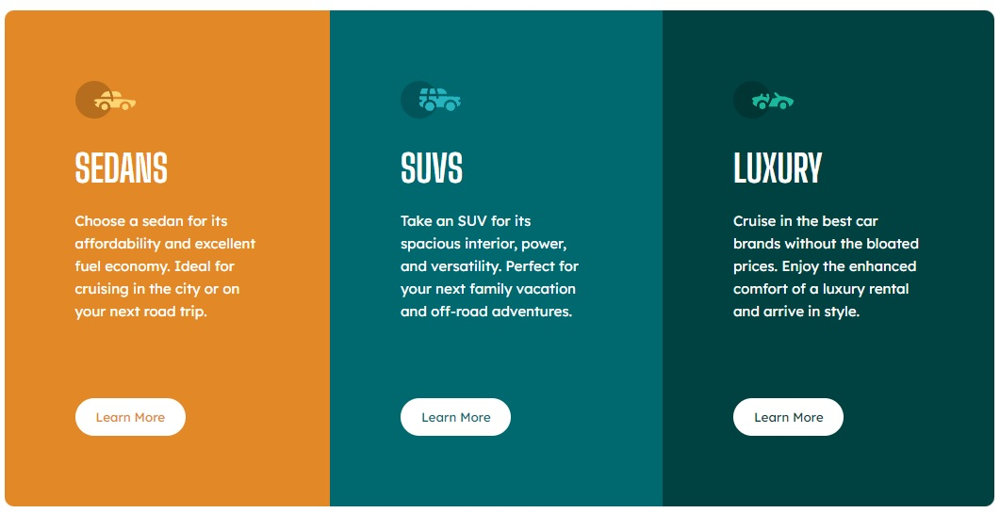

# Frontend Mentor - 3-column preview card component solution

This is a solution to the [3-column preview card component challenge on Frontend Mentor](https://www.frontendmentor.io/challenges/3column-preview-card-component-pH92eAR2-). Frontend Mentor challenges help you improve your coding skills by building realistic projects. 

## Table of contents
  - [The challenge](#the-challenge)
  - [Screenshot](#screenshot)
  - [Links](#links)
- [My process](#my-process)
  - [Built with](#built-with)
  - [Useful resources](#useful-resources)
  - [Author](#author)
  - [Acknowledgments](#acknowledgments)

### The challenge

Users should be able to:

- View the optimal layout depending on their device's screen size
- See hover states for interactive elements

### Screenshot

### Link
- Live Site URL: [https://3-column-preview-card-component-frntendmntr.netlify.app/]

### Built with

- Semantic HTML5 markup
- Vanilla CSS 
- Flexbox
- Mobile First

### Useful resources

- [resource 1](https://css-tricks.com/)
- [resource 2](https://www.w3schools.com/css/default.asp) 

## Author

- Github - [lsminobagit](https://github.com/lsminobagit)
- Linkedin - [Luciano S. Miño](www.linkedin.com/in/luciano-miño91)

## Acknowledgments

-[resource](https://www.youtube.com/watch?v=2Wy_MJPDfCw&list=LL&index=58&ab_channel=tsbsankara)
This tutorial was helpful to me to understand the functionality of the code

